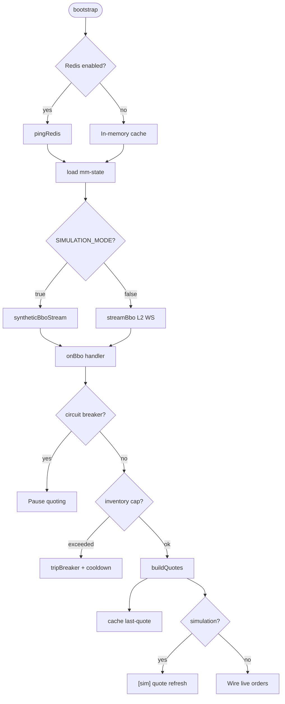
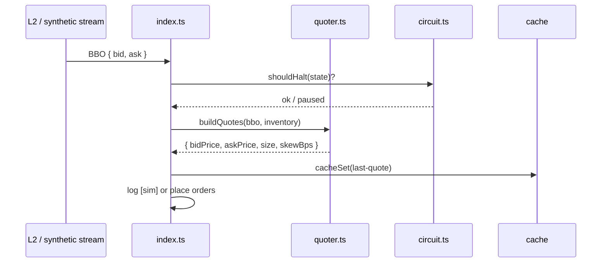

# Coinbase Market Making Bot

> Provides **liquidity** by quoting bid and ask around the **best bid-offer (BBO)** from Coinbase Advanced Trade **Level 2** data — with **inventory skew** and a **circuit breaker** when risk limits are hit.

```text
   L2 WebSocket (or synthetic BBO)
              │
              ▼
      ┌───────────────┐
      │ Quote engine  │  spread + inventory skew
      └───────┬───────┘
              │
              ▼
      ┌───────────────┐
      │ Risk layer    │  inventory cap · daily loss breaker
      └───────┬───────┘
              │
              ▼
      Limit order refresh (sim logs today)
```

---

## How it works

1. **Stream BBO** from Coinbase L2 WebSocket (or synthetic prices in simulation).
2. **Build quotes** at `SPREAD_BPS` around mid, skewed when `baseInventory` drifts from `TARGET_BASE_INVENTORY`.
3. **Refresh** quotes every `QUOTE_REFRESH_MS` — throttle prevents quote spam.
4. **Protect** with inventory cap (`MAX_BASE_INVENTORY`) and daily loss circuit breaker.
5. **Persist** risk state and last quote to Redis for restart continuity.



---

## Inventory skew

When you accumulate too much base asset, the bot **shifts quotes down** (wider bid, tighter ask) to encourage sells and rebalance toward `TARGET_BASE_INVENTORY`. Skew is expressed in basis points (`skewBps`) in logs.

```text
  Neutral inventory          Long inventory (too much BTC)
  ─────────────────          ─────────────────────────────
  bid ████████ ask           bid ██████   ask ████████
        ↑ mid                      ↑ quotes shifted down
```

---

## Project structure

```text
market-making-bot/
├── .env.example
├── package.json
├── tsconfig.json
├── README.md
│
├── scripts/
│   └── smoke-test.ts            # Quote engine math smoke test
│
└── src/
    ├── index.ts                 # BBO stream hook, quote loop, shutdown
    │
    ├── config/
    │   ├── env.ts               # Spread, inventory, breaker settings
    │   └── logger.ts
    │
    ├── cache/
    │   ├── redis.ts             # ioredis-xyz
    │   └── store.ts             # mm-state, last-quote
    │
    ├── book/
    │   ├── types.ts             # BBO shape
    │   └── level2.ts            # L2 WebSocket + synthetic stream
    │
    ├── engine/
    │   └── quoter.ts            # buildQuotes — spread + skew
    │
    └── risk/
        └── circuit.ts           # shouldHalt, tripBreaker, day roll
```

### Module map

| Path | Responsibility |
|------|----------------|
| `src/book/level2.ts` | Real L2 subscription or deterministic synthetic BBO for sim |
| `src/engine/quoter.ts` | Computes bid/ask prices and size from BBO + inventory |
| `src/risk/circuit.ts` | Daily P&L tracking, halt until `haltedUntil` timestamp |
| `src/index.ts` | Wires stream → quoter; saves `mm-state` on breaker trip |
| `src/cache/*` | Keys: `mm-state`, `last-quote` (prefix `cb-mm:`) |

---

## Run

```bash
cp .env.example .env
npm install
npm run check
SIMULATION_MODE=true npm start
```

```bash
npm run dev    # watch mode
```

---

## Configuration

| Variable | Default | Description |
|----------|---------|-------------|
| `SIMULATION_MODE` | `true` | Synthetic BBO stream |
| `PRODUCT_ID` | `BTC-USD` | Coinbase product |
| `SPREAD_BPS` | `10` | Half-spread around mid (basis points) |
| `ORDER_SIZE` | `0.001` | Base size per quote side |
| `TARGET_BASE_INVENTORY` | `0` | Neutral inventory target |
| `MAX_BASE_INVENTORY` | `0.01` | Trips breaker if exceeded |
| `QUOTE_REFRESH_MS` | `2000` | Min ms between quote updates |
| `MAX_DAILY_LOSS_USD` | `100` | Circuit breaker loss threshold |
| `CIRCUIT_BREAKER_COOLDOWN_MS` | `300000` | Pause duration after trip |

**Redis:**

```bash
REDIS_URL=redis://localhost:6379
REDIS_ENABLED=true
REDIS_KEY_PREFIX=cb-mm:
```

---

## Quote pipeline



---

## Going live

Live order placement is not wired in `index.ts` — extend with `coinbase-api` limit order calls when `SIMULATION_MODE=false`. Test skew and breaker behavior in simulation first.
